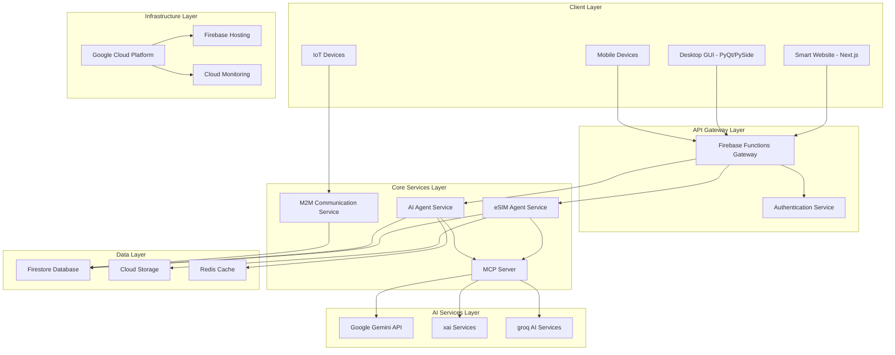

# Design Document: iGSIM AI Agent Platform

## Overview

The iGSIM AI Agent Platform is a comprehensive system that combines eSIM M2M device management with AI-powered services under the unified brand "iGSIM AI Agent powered by eSIM Myanmar". The platform implements a modern, scalable architecture using Python for backend services, Next.js for web interfaces, and Google Cloud Platform for infrastructure.

The system follows 2026 AI Agent standards and incorporates modern UI/UX design patterns inspired by accio.com, featuring clean layouts, bold typography, minimalist design with neumorphism elements, and responsive interfaces across all devices.

## Architecture

### High-Level Architecture



### Service Architecture Patterns

The platform follows a microservices architecture with the following patterns:

1. **API Gateway Pattern**: Firebase Functions serve as the entry point for all client requests
2. **Service Mesh Pattern**: Core services communicate through well-defined interfaces
3. **Event-Driven Architecture**: Services communicate via Cloud Pub/Sub for asynchronous operations
4. **CQRS Pattern**: Separate read and write operations for optimal performance
5. **Circuit Breaker Pattern**: Fault tolerance for external AI service calls

## Components and Interfaces

### 1. Smart Website (Next.js Frontend)

**Technology Stack:**
- Next.js 14+ with App Router
- Tailwind CSS for styling
- TypeScript for type safety
- React Query for state management
- Framer Motion for animations

**Key Features:**
- Responsive design following accio.com patterns
- Clean navigation with predictable element placement
- Bento grid layouts for dashboards
- Bold typography with high-contrast text
- Micro-interactions and ambient animations
- Dynamic dark mode support
- Minimalist design with neumorphism elements

**Interface Definition:**
```typescript
interface SmartWebsiteAPI {
  // Authentication
  login(credentials: UserCredentials): Promise<AuthToken>
  logout(): Promise<void>
  
  // Device Management
  getDevices(): Promise<Device[]>
  provisionDevice(deviceInfo: DeviceInfo): Promise<ProvisionResult>
  
  // AI Services
  queryAI(prompt: string, context?: AIContext): Promise<AIResponse>
  
  // Dashboard
  getDashboardData(): Promise<DashboardData>
}
```

### 2. Desktop GUI (PyQt/PySide)

**Technology Stack:**
- PyQt6/PySide6 for native desktop experience
- QML for modern UI components
- Python 3.11+ backend integration
- SQLite for local caching

**Key Features:**
- Native desktop performance
- Offline capability with sync
- Advanced device management tools
- Real-time monitoring dashboards
- System tray integration

**Interface Definition:**
```python
class DesktopGUIInterface:
    def __init__(self, config: AppConfig):
        self.config = config
        self.api_client = APIClient(config.api_base_url)
    
    def show_main_window(self) -> None:
        """Display the main application window"""
        pass
    
    def handle_device_event(self, event: DeviceEvent) -> None:
        """Handle real-time device events"""
        pass
    
    def sync_data(self) -> SyncResult:
        """Synchronize local data with cloud services"""
        pass
```

### 3. eSIM Agent Service

**Core Responsibilities:**
- Device authentication and validation
- eSIM profile provisioning following GSMA SGP.32 standards
- M2M communication management
- Device lifecycle management
- Security and compliance enforcement

**Interface Definition:**
```python
class eSIMAgentService:
    def authenticate_device(self, device_id: str, credentials: dict) -> AuthResult:
        """Authenticate device for eSIM services"""
        pass
    
    def provision_esim(self, device_id: str, profile_data: eSIMProfile) -> ProvisionResult:
        """Provision eSIM profile to authenticated device"""
        pass
    
    def manage_device(self, device_id: str, action: DeviceAction) -> ManagementResult:
        """Perform device management operations"""
        pass
    
    def get_device_status(self, device_id: str) -> DeviceStatus:
        """Get real-time device status and configuration"""
        pass
```

### 4. AI Agent Service

**Core Responsibilities:**
- Natural language processing via Gemini API
- Multi-modal AI interactions
- Context management through MCP
- Intelligent automation and recommendations
- Performance optimization and caching

**Interface Definition:**
```python
class AIAgentService:
    def process_query(self, query: str, context: AIContext) -> AIResponse:
        """Process natural language queries"""
        pass
    
    def generate_recommendations(self, user_data: UserData) -> List[Recommendation]:
        """Generate intelligent recommendations"""
        pass
    
    def analyze_device_data(self, device_data: DeviceData) -> AnalysisResult:
        """Analyze device performance and health"""
        pass
```

### 5. MCP Server Implementation

**Core Responsibilities:**
- Standardized AI service communication
- Context management and sharing
- Protocol compliance with MCP 2026 standards
- Service discovery and routing
- Error handling and fallback mechanisms

**Interface Definition:**
```python
class MCPServer:
    def __init__(self, config: MCPConfig):
        self.config = config
        self.services = {}
    
    def register_service(self, service_name: str, service: AIService) -> None:
        """Register AI service with MCP server"""
        pass
    
    def handle_request(self, request: MCPRequest) -> MCPResponse:
        """Handle MCP protocol requests"""
        pass
    
    def manage_context(self, context_id: str, context_data: dict) -> None:
        """Manage AI context across services"""
        pass
```

### 6. M2M Communication Service

**Core Responsibilities:**
- Device-to-device communication protocols
- Real-time data streaming
- Protocol translation and routing
- Security and encryption
- Performance monitoring

**Interface Definition:**
```python
class M2MService:
    def establish_connection(self, device_a: str, device_b: str) -> ConnectionResult:
        """Establish secure M2M connection"""
        pass
    
    def route_message(self, message: M2MMessage) -> RoutingResult:
        """Route messages between devices"""
        pass
    
    def monitor_connection(self, connection_id: str) -> ConnectionStatus:
        """Monitor M2M connection health"""
        pass
```

## Data Models

### Core Data Structures

```python
from dataclasses import dataclass
from typing import Optional, List, Dict, Any
from datetime import datetime
from enum import Enum

class DeviceStatus(Enum):
    ACTIVE = "active"
    INACTIVE = "inactive"
    PROVISIONING = "provisioning"
    ERROR = "error"

class AIServiceType(Enum):
    GEMINI = "gemini"
    XAI = "xai"
    GROQ = "groq"

@dataclass
class Device:
    device_id: str
    device_type: str
    status: DeviceStatus
    esim_profile: Optional['eSIMProfile']
    last_seen: datetime
    metadata: Dict[str, Any]
    
    def is_active(self) -> bool:
        return self.status == DeviceStatus.ACTIVE

@dataclass
class eSIMProfile:
    profile_id: str
    iccid: str
    operator: str
    plan_type: str
    activation_date: Optional[datetime]
    expiry_date: Optional[datetime]
    data_usage: Dict[str, int]
    
    def is_expired(self) -> bool:
        return self.expiry_date and self.expiry_date < datetime.now()

@dataclass
class AIContext:
    context_id: str
    user_id: str
    session_data: Dict[str, Any]
    conversation_history: List['AIMessage']
    preferences: Dict[str, Any]
    
    def add_message(self, message: 'AIMessage') -> None:
        self.conversation_history.append(message)

@dataclass
class AIMessage:
    message_id: str
    content: str
    role: str  # 'user' or 'assistant'
    timestamp: datetime
    service_type: AIServiceType
    metadata: Dict[str, Any]

@dataclass
class User:
    user_id: str
    email: str
    display_name: str
    role: str
    permissions: List[str]
    created_at: datetime
    last_login: Optional[datetime]
    preferences: Dict[str, Any]
    
    def has_permission(self, permission: str) -> bool:
        return permission in self.permissions

@dataclass
class MCPRequest:
    request_id: str
    service_name: str
    method: str
    parameters: Dict[str, Any]
    context: Optional[AIContext]
    timestamp: datetime

@dataclass
class MCPResponse:
    request_id: str
    success: bool
    data: Optional[Dict[str, Any]]
    error: Optional[str]
    timestamp: datetime
```

### Database Schema (Firestore)

```javascript
// Collections structure
{
  "users": {
    "user_id": {
      "email": "string",
      "display_name": "string",
      "role": "string",
      "permissions": ["string"],
      "created_at": "timestamp",
      "last_login": "timestamp",
      "preferences": {}
    }
  },
  
  "devices": {
    "device_id": {
      "device_type": "string",
      "status": "string",
      "esim_profile": {
        "profile_id": "string",
        "iccid": "string",
        "operator": "string",
        "plan_type": "string",
        "activation_date": "timestamp",
        "expiry_date": "timestamp",
        "data_usage": {}
      },
      "last_seen": "timestamp",
      "metadata": {}
    }
  },
  
  "ai_contexts": {
    "context_id": {
      "user_id": "string",
      "session_data": {},
      "conversation_history": [
        {
          "message_id": "string",
          "content": "string",
          "role": "string",
          "timestamp": "timestamp",
          "service_type": "string",
          "metadata": {}
        }
      ],
      "preferences": {}
    }
  },
  
  "audit_logs": {
    "log_id": {
      "user_id": "string",
      "action": "string",
      "resource": "string",
      "timestamp": "timestamp",
      "details": {}
    }
  }
}
```

Now I need to use the prework tool to analyze the acceptance criteria before writing the Correctness Properties section:

<function_calls>
<invoke name="prework">
<parameter name="featureName">igsim-ai-agent-platform

## Correctness Properties

*A property is a characteristic or behavior that should hold true across all valid executions of a system—essentially, a formal statement about what the system should do. Properties serve as the bridge between human-readable specifications and machine-verifiable correctness guarantees.*

Based on the prework analysis, I've identified several key properties that can be consolidated to eliminate redundancy while maintaining comprehensive coverage:

### Property Reflection

After reviewing all testable acceptance criteria, I've identified the following consolidations:
- Brand consistency properties (1.1, 1.2) can be combined into a single comprehensive branding property
- AI service integration properties (5.1, 5.2, 5.3) can be consolidated into one multi-service property
- Cloud deployment properties (6.1, 6.6) can be combined into a single deployment configuration property
- Technology stack properties (4.1, 4.2) can be consolidated into a framework compliance property
- Authentication and security properties (8.1, 8.2) can be combined into a comprehensive security property

### Core Properties

**Property 1: Brand Consistency Across All Interfaces**
*For any* interface component in the iGSIM platform, it should display the "iGSIM AI Agent powered by eSIM Myanmar" branding and maintain consistent brand elements and styling
**Validates: Requirements 1.1, 1.2**

**Property 2: Google Cloud Project Integration**
*For any* cloud operation performed by the platform, it should use the Google Cloud project "bamboo-reason-483913-i4" and maintain proper authentication and project binding
**Validates: Requirements 1.5, 6.1, 6.6**

**Property 3: Device Authentication and Provisioning**
*For any* device requesting eSIM services, authentication should succeed for valid credentials and fail for invalid ones, and authenticated devices should receive valid eSIM profiles automatically
**Validates: Requirements 2.1, 2.2**

**Property 4: Real-time Device Management**
*For any* device management request, the system should provide current device status and configuration information in real-time
**Validates: Requirements 2.3**

**Property 5: Secure M2M Communication**
*For any* pair of devices communicating through the M2M service, the communication should use secure protocols and maintain data integrity
**Validates: Requirements 2.4**

**Property 6: Audit Logging Completeness**
*For any* provisioning or management activity performed by the eSIM Agent, a corresponding audit log entry should be created with complete activity details
**Validates: Requirements 2.5**

**Property 7: Connectivity Diagnostics**
*For any* device connectivity issue that occurs, the eSIM Agent should provide appropriate diagnostic information and resolution recommendations
**Validates: Requirements 2.6**

**Property 8: Responsive Design Adaptation**
*For any* viewport size or device type, the Smart Website should adapt its layout correctly while maintaining functionality and readability
**Validates: Requirements 3.1**

**Property 9: UI/UX Design Compliance**
*For any* UI component rendered by the Smart Website, it should conform to accio.com-inspired design patterns including professional fonts, appropriate button sizes, and clear data presentation
**Validates: Requirements 3.2, 3.4**

**Property 10: AI Service Accessibility**
*For any* AI-powered feature request, the Smart Website should successfully access and utilize the integrated AI services (Gemini, xai, groq)
**Validates: Requirements 3.3, 5.1, 5.2, 5.3**

**Property 11: Interactive Feedback Responsiveness**
*For any* user interaction with forms or controls, the Smart Website should provide immediate feedback and validation
**Validates: Requirements 3.5**

**Property 12: Systematic Layout Organization**
*For any* page structure in the Smart Website, elements should be organized following systematic layout principles with logical hierarchy
**Validates: Requirements 3.6**

**Property 13: Technology Stack Compliance**
*For any* component in the platform, desktop GUI components should use PyQt/PySide and web components should use Next.js with Tailwind CSS
**Validates: Requirements 4.1, 4.2**

**Property 14: Deployment Tool Integration**
*For any* deployment operation, the platform should utilize Google Cloud CLI and Firebase CLI tools correctly
**Validates: Requirements 4.3**

**Property 15: Multi-AI Service Connectivity**
*For any* AI service call, the platform should successfully connect to and receive responses from Google Gemini API, xai services, and groq AI services
**Validates: Requirements 4.4**

**Property 16: MCP Protocol Compliance**
*For any* AI service communication, the MCP Server should handle Model Context Protocol messages correctly according to the specification
**Validates: Requirements 4.5, 5.4**

**Property 17: Firebase Hosting Deployment**
*For any* deployment to production, the platform should successfully deploy to Firebase Hosting at bamboo-reason-483913-i4.web.app
**Validates: Requirements 4.6**

**Property 18: AI Service Fallback Mechanisms**
*For any* AI service failure scenario, the platform should activate appropriate fallback mechanisms and continue operation
**Validates: Requirements 5.5**

**Property 19: AI Response Caching**
*For any* repeated AI query, the platform should cache responses appropriately and retrieve cached results when applicable to optimize performance
**Validates: Requirements 5.6**

**Property 20: Automated Deployment Triggers**
*For any* code push to the main branch, the platform should trigger automated deployment processes correctly
**Validates: Requirements 6.3**

**Property 21: Git Repository Integration**
*For any* version control operation, the platform should integrate correctly with the Git repository at github.com/nexorasim/igsims
**Validates: Requirements 6.4**

**Property 22: Google Cloud API Enablement**
*For any* platform setup or operation requiring Google Cloud APIs, all necessary APIs should be enabled automatically
**Validates: Requirements 6.5, 7.4**

**Property 23: Development Environment Setup Automation**
*For any* development environment setup, the platform should automatically install and configure Google Cloud CLI, Firebase CLI, and Gemini CLI correctly
**Validates: Requirements 7.1, 7.2**

**Property 24: MCP Server Configuration**
*For any* Google Cloud integration requirement, the MCP server should be configured correctly to handle the integration
**Validates: Requirements 7.3**

**Property 25: Additional Component Installation**
*For any* platform setup, all additional gcloud components (alpha, beta, skaffold, minikube, kubectl, gke-gcloud-auth-plugin) should be installed correctly
**Validates: Requirements 7.5**

**Property 26: Gemini CLI Sandbox Configuration**
*For any* Gemini CLI operation, the sandbox should be configured correctly with Docker integration
**Validates: Requirements 7.6**

**Property 27: Comprehensive Authentication Security**
*For any* user access attempt or API call, the platform should implement secure authentication and validate authentication tokens correctly
**Validates: Requirements 8.1, 8.2**

**Property 28: Data Encryption**
*For any* sensitive data handled by the platform, it should be encrypted both in transit and at rest
**Validates: Requirements 8.3**

**Property 29: Role-Based Access Control**
*For any* user with a specific role, the platform should enforce access permissions correctly based on that role
**Validates: Requirements 8.4**

**Property 30: Security Event Logging**
*For any* security event that occurs, the platform should log it appropriately for monitoring and analysis
**Validates: Requirements 8.5**

**Property 31: Security Standards Compliance**
*For any* eSIM and M2M service operation, the platform should comply with industry security standards
**Validates: Requirements 8.6**

**Property 32: Firestore Storage Usage**
*For any* document storage operation, the platform should use Firestore as the storage backend
**Validates: Requirements 9.1**

**Property 33: Data Consistency and Integrity**
*For any* concurrent data storage operation, the platform should maintain data consistency and integrity
**Validates: Requirements 9.2**

**Property 34: Data Backup and Recovery**
*For any* data backup or recovery operation, the platform should execute the process correctly and maintain data integrity
**Validates: Requirements 9.3**

**Property 35: Data Export Capabilities**
*For any* data export request, the platform should provide complete and accurate data export for compliance requirements
**Validates: Requirements 9.4**

**Property 36: Query Performance Optimization**
*For any* data query performed, the platform should optimize for both performance and cost efficiency
**Validates: Requirements 9.5**

**Property 37: Data Retention Policy Compliance**
*For any* data stored in the platform, it should be retained and purged according to specified regulatory policies
**Validates: Requirements 9.6**

**Property 38: Real-time Performance Monitoring**
*For any* system operation, the platform should monitor performance and availability in real-time
**Validates: Requirements 10.1**

**Property 39: Error Alerting**
*For any* error or issue that occurs, the platform should alert administrators immediately
**Validates: Requirements 10.2**

**Property 40: Usage Analytics Collection**
*For any* platform usage, analytics data should be collected for optimization purposes
**Validates: Requirements 10.3**

**Property 41: Monitoring Dashboard Accuracy**
*For any* key metric displayed on monitoring dashboards, the information should be accurate and up-to-date
**Validates: Requirements 10.4**

**Property 42: Auto-scaling Triggers**
*For any* performance threshold that is exceeded, the platform should trigger appropriate scaling actions
**Validates: Requirements 10.5**

**Property 43: Business Intelligence Reporting**
*For any* report generation request, the platform should generate accurate and complete reports for business intelligence and compliance
**Validates: Requirements 10.6**

## Error Handling

### Error Categories and Strategies

**1. AI Service Failures**
- **Circuit Breaker Pattern**: Prevent cascading failures when AI services are unavailable
- **Graceful Degradation**: Provide limited functionality when AI services fail
- **Retry Logic**: Implement exponential backoff for transient failures
- **Fallback Responses**: Use cached responses or simplified alternatives

**2. eSIM Provisioning Errors**
- **Validation Errors**: Clear error messages for invalid device credentials
- **Network Failures**: Retry mechanisms for network connectivity issues
- **Profile Conflicts**: Handle duplicate or conflicting eSIM profiles
- **Timeout Handling**: Manage long-running provisioning operations

**3. Authentication and Authorization Errors**
- **Token Expiration**: Automatic token refresh mechanisms
- **Permission Denied**: Clear error messages with suggested actions
- **Rate Limiting**: Implement backoff strategies for rate-limited requests
- **Session Management**: Handle session timeouts gracefully

**4. Data Consistency Errors**
- **Conflict Resolution**: Implement last-writer-wins or merge strategies
- **Transaction Failures**: Rollback mechanisms for failed operations
- **Validation Errors**: Comprehensive data validation with clear error messages
- **Backup Failures**: Alert mechanisms and manual intervention procedures

**5. Infrastructure Errors**
- **Service Unavailability**: Health checks and automatic failover
- **Resource Exhaustion**: Auto-scaling and resource monitoring
- **Network Partitions**: Eventual consistency and conflict resolution
- **Deployment Failures**: Rollback mechanisms and blue-green deployments

### Error Response Format

```python
@dataclass
class ErrorResponse:
    error_code: str
    error_message: str
    error_details: Optional[Dict[str, Any]]
    timestamp: datetime
    request_id: str
    suggested_actions: List[str]
    
    def to_dict(self) -> Dict[str, Any]:
        return {
            "error": {
                "code": self.error_code,
                "message": self.error_message,
                "details": self.error_details,
                "timestamp": self.timestamp.isoformat(),
                "request_id": self.request_id,
                "suggested_actions": self.suggested_actions
            }
        }
```

## Testing Strategy

### Dual Testing Approach

The iGSIM AI Agent Platform requires both unit testing and property-based testing to ensure comprehensive coverage:

**Unit Tests**: Focus on specific examples, edge cases, and error conditions
- Integration points between components
- Specific error scenarios and edge cases
- API endpoint behavior with known inputs
- UI component rendering with specific data

**Property Tests**: Verify universal properties across all inputs
- Data consistency across concurrent operations
- Authentication behavior across all user types
- UI responsiveness across all viewport sizes
- AI service integration across all query types

### Property-Based Testing Configuration

**Testing Framework**: Use Hypothesis for Python property-based testing
- **Minimum Iterations**: 100 iterations per property test
- **Test Tagging**: Each property test must reference its design document property
- **Tag Format**: `# Feature: igsim-ai-agent-platform, Property {number}: {property_text}`

**Example Property Test Structure**:
```python
from hypothesis import given, strategies as st
import pytest

@given(st.text(min_size=1), st.integers(min_value=1, max_value=1000))
def test_brand_consistency_property(interface_component, viewport_width):
    """
    Feature: igsim-ai-agent-platform, Property 1: Brand Consistency Across All Interfaces
    For any interface component, it should display the required branding
    """
    rendered_component = render_component(interface_component, viewport_width)
    assert "iGSIM AI Agent powered by eSIM Myanmar" in rendered_component.text
    assert has_consistent_brand_elements(rendered_component)

@given(st.text(), st.text())
def test_device_authentication_property(device_id, credentials):
    """
    Feature: igsim-ai-agent-platform, Property 3: Device Authentication and Provisioning
    For any device requesting eSIM services, authentication should work correctly
    """
    auth_result = esim_agent.authenticate_device(device_id, credentials)
    if is_valid_credentials(credentials):
        assert auth_result.success
        profile = esim_agent.provision_esim(device_id, generate_profile())
        assert profile.is_valid()
    else:
        assert not auth_result.success
```

### Testing Coverage Requirements

**Unit Test Coverage**:
- Minimum 80% code coverage for all core services
- 100% coverage for critical security functions
- Edge case testing for all public APIs
- Error condition testing for all failure modes

**Property Test Coverage**:
- All 43 correctness properties must have corresponding property tests
- Each property test must run minimum 100 iterations
- Property tests must cover all major input domains
- Integration property tests for cross-service interactions

### Continuous Integration Testing

**Pre-commit Hooks**:
- Code formatting with Black
- Linting with Ruff
- Type checking with MyPy
- Unit test execution

**CI/CD Pipeline**:
- Unit tests on all Python versions (3.11+)
- Property tests with extended iteration counts (1000+)
- Integration tests against Firebase emulators
- Security scanning with Bandit
- Performance benchmarking for critical paths

**Testing Environments**:
- **Local Development**: Firebase emulators and mock AI services
- **Staging**: Real Firebase services with test data
- **Production**: Monitoring and alerting with real-time validation